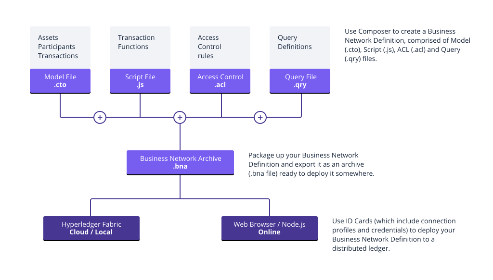

# **Hyperledger Composer**

Hyperledger Composer là một bộ công cụ phát triển và framework mở rộng để phát triển các ứng dụng blockchain dễ dàng hơn. Mục đích chính là tăng tốc thời gian và giúp tích hợp các ứng dụng blockchain với các hệ thống kinh doanh hiện tại dễ dàng hơn. Có thể sử dụng Composer để nhanh chóng phát triển các use case và triển khai giải pháp blockchain trong vài tuần thay vì vài tháng. Composer cho phép mô hình hoá mạng kinh doanh và tích hợp các hệ thống đã có và dữ liệu với các ứng dụng blockchain.

Hyperledger Composer hỗ trợ cơ sở hạ tầng và thực thi blockchain Hyperledger Fabric, hỗ trợ cài đặt các giao thức đồng thuận blockchain để đảm bảo các giao dịch được xác thực theo chính sách bởi các bên tham gia mạng kinh doanh chọn.

Các ứng dụng hàng ngày có thể lấy dữ liệu từ mạng kinh doanh, cung cấp cho người dùng cuối các điểm truy cập đơn giản và có kiểm soát.

Có thể sử dụng Hyperledger Composer để mô hình hoá nhanh chóng mạng kinh doanh hiện tại của bạn, chứa các tài sản hiện có và các giao dịch liên quan đến chúng; các tài sản là hàng hoá, dịch vụ hoặc sở hữu hữu hình hoặc vô hình. Là một phần của mô hình mạng kinh doanh, bạn xác định các giao dịch có thể tương tác với tài sản. Các mạng kinh doanh cũng bao gồm các bên tham gia tương tác với chúng, mỗi bên trong đó có thể liên kết với định danh duy nhất, trên nhiều mạng kinh doanh.

## **Kiến trúc giải pháp Hyperledger Composer điển hình**

Hyperledger Composer cho phép các kiến trúc và nhà phát triển nhanh chóng tạo ra các giải pháp blockchain "full-stack". Phát triển logic kinh doanh chạy trên blockchain, API REST hiển thị logic blockchain cho các ứng dụng web hoặc di động, cũng như tích hợp blockchain với các hệ thống hồ sơ doanh nghiệp hiện có.

