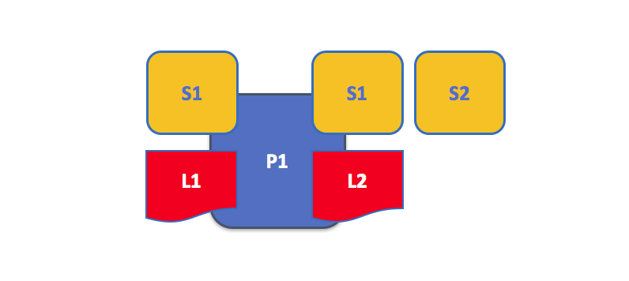
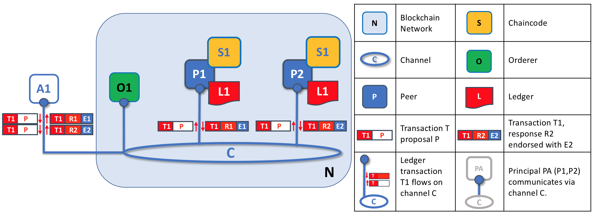

# **Mô hình hoạt động**

## **1. Nút ngang hàng**

Mạng blockchain được hình thành từ các nút ngang hàng, mỗi nút có bản sao các sổ cái và các smart contract. 

Trong ví dụ trên, mạng N được hình thành bởi 3 nút P1, P2 và P3 mỗi nút đều có sổ cái L1 và chaincode S1.

## **2. Sổ cái và chaincode**

Một nút ngang hàng lưu trữ sổ cái và chaincode. Có thể có nhiều sổ cái và chaincode trên mỗi nút.

## **3. Ứng dụng và Nút ngang hàng**

Các nút ngang hàng kết hợp với nút Orderer đảm bảo sổ cái được cập nhật trên mọi nút. Trong ví dụ trên:
* **Bước 1** Ứng dụng A kết nối với P1.
* **Bước 2** Ứng dụng A gọi chaincode S1 qua P1 để truy vấn hoặc cập nhật sổ cái L1. 
* **Bước 2.1** P1 gọi S1 để với yêu cầu của A
* **Bước 2.2** S1 sinh ra truy vấn hoặc cập nhật L1. 
* **Bước 3** Nếu là truy vấn A nhận được kết quả.
* **Bước 4** Nếu là cập nhật A tạo ra giao dịch từ kết quả, gửi yêu cầu đến O1.
* **Bước 4.1** O1 tập hợp các giao dịch thành khối và gửi đến các nút ngang hàng.
* **Bước 4.2** P1 xác nhận giao dịch trước khi thêm vào L1, sinh ra event cho A nhận.

## **4. Nút ngang hàng và kênh**

Kênh cho phép chỉ định tập các nút và ứng dụng giao tiếp với nhau trong mạng blockchain. Trong ví dụ trên, ứng dụng A giao tiếp với nút P1 trực tiếp và với nút P2 qua kênh C. 

## **5. Nút ngang hàng và Tổ chức**

Các nút ngang hàng trong một mạng với nhiều tổ chức.

Trong ví dụ trên có 4 tổ chức với 8 nút mạng tham gia. Kênh C kết nối 5 nút trong mạng N - P1, P3, P5, P7 và P8. Trong một tổ chức sẽ có ít nhất 1 nút tham gia kênh. Các ứng dụng của một tổ chức sẽ kết nối tới các nút của tổ chức khác. Ở đây các nút orderer được bỏ qua để sơ đồ đơn giản hơn.

## **6. Nút ngang hàng và Định danh**

Mọi nút ngang hàng được đăng ký chứng chỉ bởi quản trị viên của tổ chức.

Khi một nút kết nối tới kênh, chứng chỉ của nó xác định tổ chức thông qua kênh MSP. Trong ví dụ trên, P1 và P2 được định danh bởi CA1. Kênh C xác định từ chính sách trong cấu hình của mình rằng các định danh từ CA1 phải liên kết với Org1 bởi ORG1.MSP. Tương tự P3 và P4 được ORG2.MSP xác định là 1 phần của Org2

## **7. Nút ngang hàng và nút Orderer**

Nút Orderer là một nút đặc biệt dùng trong cập nhật giao dịch, một nút ngang hàng yêu cầu các nút mạng khác duyệt cập nhật sổ cái trước khi thực sự cập nhật sổ cái cục bộ của các nút. Tiến trình này gọi là *đồng thuận*, các ứng dụng muốn cập nhật sổ cái phải thực hiện 3 bước.

### **7.1. Bước 1: Đề nghị** 

Giao dịch đề nghị được thực hiện độc lập bởi các nút ngang hàng nơi phản hồi các đề nghị được chứng thực. Trong ví dụ trên, ứng dụng A1 sinh giao dịch T1 đề nghị P gửi đến cả nút P1 và P2 trên kênh C. P1 thực thi S1 sử dụng giao dịch T1 đề nghị sinh ra giao dịch T1 phản hồi R1 mà nó xác nhận với E1. Một cách độc lập, P2 thực thi S1 sử dụng giao dịch T1 đề nghị P sinh ra giao dịch T1 phản hồi R2 mà nó xác nhận với E2. Ứng dụng A1 nhận cả 2 phản hồi xác thực cho giao dịch T1, tên là E1 và E2.

### **7.2. Bước 2: Đóng gói**

Vai trò đầu tiên của nút orderer là đóng gói các yêu cầu cập nhật sổ cái. Trong ví dụ trên, A1 gửi giao dịch T1 xác thực bởi E1 và E2 tới orderer O1. Song song, ứng dụng A2 gửi giao dịch T2 chứng thực bởi E1 tới orderer O1. O1 đóng gói giao dịch T1 từ A1 và T2 từ A2 cùng với các giao dịch từ các ứng dụng khác trong mạng vào block B2. CÓ thể thấy trong B2, các giao dịch yêu cầu là T1, T2, T3, T4, T6, T5.

### **7.3. Bước 3: Xác thực**

Vai trò thứ hai của nút orderer là phân phối các khối tới các nút mạng. Trong ví dụ, orderer O1 phân phối khối B2 tới nút P1 và P2. Nút P1 xử lý khối B2, kết quả nằm trong 1 khối mới thêm vào sổ cái L1 trên P1. Song song, nút P2 xử lý khối B2, kết quả nằm trong một khối mới thêm vào sổ cái L1 nằm trên P2. Một khi tiến trình hoàn tất, sổ cái L1 sẽ được nhất quán cập nhật trên P1 và P2, và mỗi nút thông báo tới ứng dụng đã kết nối giao dịch đã được xử lý.

## **8. Orderer và đồng thuận**

Toàn bộ quy trình xử lý giao dịch được gọi là đồng thuận bởi vì tất cả các nút mạng đã đạt được thoả thuận về thứ tự và nội dung của giao dịch, trong một tiến trình có trung gian là orderer. Đồng thuận là một tiến trình bao gồm nhiều bước và các ứng dụng chỉ nhận được thông báo về cập nhật sổ cái khi quá trình hoàn tất - có thể xảy ra ở các thời điểm hơi khác ở các nút khác nhau. 

