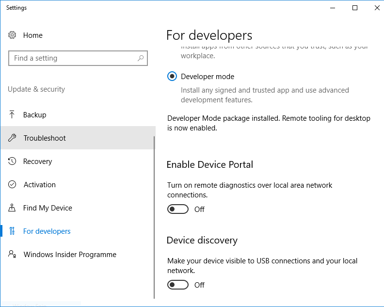
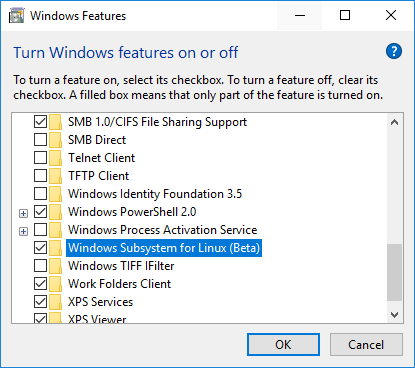
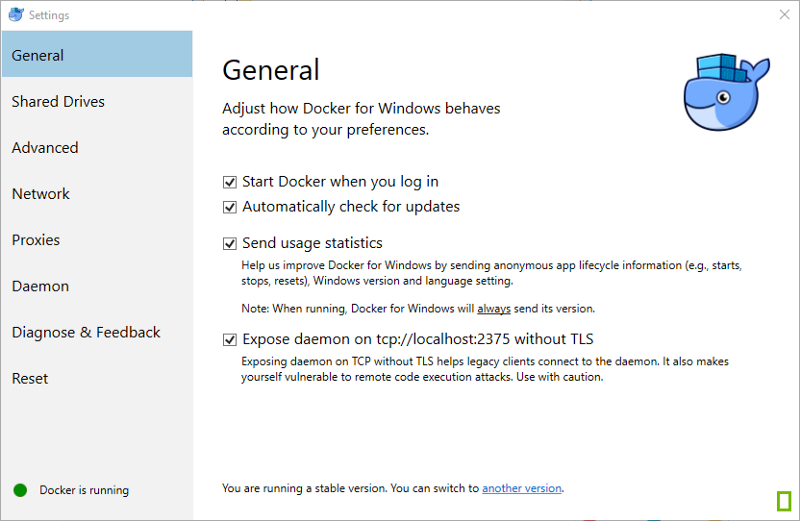

# **Cài đặt trên Windows 10**

## **1. Cài đặt Ubuntu**

1. Enable Hyper-V



2. Enable Windows Subsystem for Linux



3. Install Ubuntu

    Vào Windows Store tìm Ubuntu và cài đặt

## **2. Cài đặt Docker CE**

### **2.1. Kết nối Docker CE trên Windows 10 với Ubuntu**

* Mở cổng 2375 cho daemon



* Thiết lập biến môi trường trên Ubuntu: thêm biến DOCKER_HOST mọi lần chạy Bash.

```sh
echo "export DOCKER_HOST='tcp://0.0.0.0:2375'" >> ~/.bashrc
source ~/.bashrc
```

### **2.3. Cài docker compose trên Ubuntu**

```sh
sudo apt install docker-compose
``` 

## **3. Cài đặt thư viện**

### **3.1. Cài go**

```sh
wget https://dl.google.com/go/go1.10.3.linux-amd64.tar.gz
sudo tar -xvf go1.10.3.linux-amd64.tar.gz
export GOPATH=$HOME/go
export PATH=$PATH:$GOPATH/bin
```

### **3.2. Cài NodeJs 8.9**

Phiên bản Node.js 9.x chưa được hỗ trợ.

```sh
curl -o- https://raw.githubusercontent.com/creationix/nvm/v0.33.11/install.sh | bash
nvm install 8.9.4
```

```sh
sudo apt-get install build-essential
```

Kiểm tra phiên bản npm 5.6.0

```sh
npm --version 
```

### **3.3. Kiểm tra phiên bản python 2.7**

```sh
python --version
```

## **4. Mount ổ**

### **4.1. Share ổ**

Share ổ giữa Windows và Ubuntu, cho phép Ubuntu dùng ổ e của Windows

### **4.2. Mount ổ**

```sh
sudo mkdir /e
sudo mount --bind /mnt/e /e
mkdir /e/blockchain && cd /e/blockchain
```

#

*Cách khác để bật tắt Hyper-V*

* Enable Hyper-V

```cmd
dism.exe /Online /Enable-Feature:Microsoft-Hyper-V /All
```

* Disable Hyper-V

```cmd
dism.exe /Online /Disable-Feature:Microsoft-Hyper-V-All
```