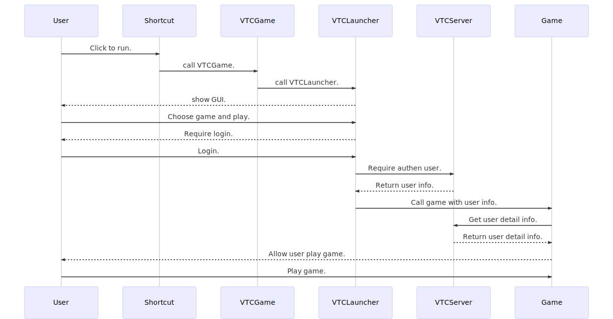

# **VTC Launcher integrate**

## **Version: 0.2**
## **Update History**:

| Version   | Update                                                   | Date        |
|----------:|----------------------------------------------------------|-------------|
| **v0.2**  | - Diagram add buy item flow.                             | 19-07-2019  |
|           | - CLIENT ID of LIVE environment.                         |             |
| **v0.1**  | Initialize document.                                     | 17-07-2019  |

## **Table of contents**
* [1. Sequence diagram](#1-Sequence-diagram)
* [2. Shortcut](#2-Shortcut)
* [3. Call game](#3-Call-game)
* [4. Get detail VTC's account](#4-Get-detail-VTC's-account)
	* [4.1. Environment](#41-Environment)
	* [4.2. Get account detail](#42-Get-account-detail)
	* [4.3. Wap payment](#43-Wap-payment)
* [5. The accounts for testing on the SANDBOX](#5-The-accounts-for-testing-on-the-SANDBOX)

## **1. Sequence diagram**



## **2. Shortcut**

Game shortcut call **VTCLauncher.exe** with parameter **ragnarok** instead for **Ragnarok.exe**. 

```cmd
VTCLauncher.exe ragnarok
```

_Note: **VTCLauncher.exe** located in the same directory with **Ragnarok.exe**._

## **3. Call game**

VTC Launcher call the game by the command line as below:
```cmd
Ragnarok.exe User=<Username> Token=<AccessToken> BToken=<BillingAccessToken>
```
Parameters:  
1.  **User**: Username.
2.  **Token**: Access token to get user information.
3.  **BToken**: Billing accesss token to do payment in the game.

## **4. Get detail VTC's account**

### **4.1. Environment**

* SANDBOX: 
	* HOST: http://apisdk1.vtcgame.vn
	* CLIENT ID: **843daedbe694061c362eddd76200b9e0**
* LIVE: 
	* HOST: https://apisdk.vtcgame.vn
	* CLIENT ID: **2aa32a67b771fcab4fd501273ef8b744**

### **4.2. Get account detail**

* URL: sdk/account/detail
* Method: GET
* Params:
	- client_id: CLIENT ID
	- access_token: **Token**
	- username: **User**
* Example:
	* SANDBOX:
		```http
		http://apisdk1.vtcgame.vn/sdk/account/detail?client_id=843daedbe694061c362eddd76200b9e0&access_token=a4596aed-a6ff-4b69-a12e-25704c9c256e&username=vtctest01
		```
	* LIVE:
		```http
		https://apisdk.vtcgame.vn/sdk/account/detail?client_id=2aa32a67b771fcab4fd501273ef8b744&access_token=3ff10246-1bdd-4d77-a300-ab63a659474b&username=zorroxtm
		```
* Result:
	```
	{
		"error": 200,
		"message": "Success",
		"info": {
			"id": "117813683",
			"userName": "vtctest01",
			"password": "",
			"fullName": "vtctest01",
			"email": "Quytn@vtc.vn",
			"birthday": 1177977600000,
			"locationId": 24,
			"userPassport": "",
			"userStatus": 1,
			"mobile": "",
			"gender": 0,
			"address": "",
			"vcoinGame": 0,
			"vcoinPayment": 112406,
			"paygateId": 0,
			"timeStored": null,
			"billingAccessToken": null,
			"gameClientIds": null
		}
	}
	```

### **4.3. Wap payment**

* SANDBOX:
* LIVE:

## **5. The accounts for testing on the SANDBOX**

* accounts: vtctest01 -> vtctest99
* password: 123456

*Note: **vtctest10** account has **OTP** default is 123456.*
